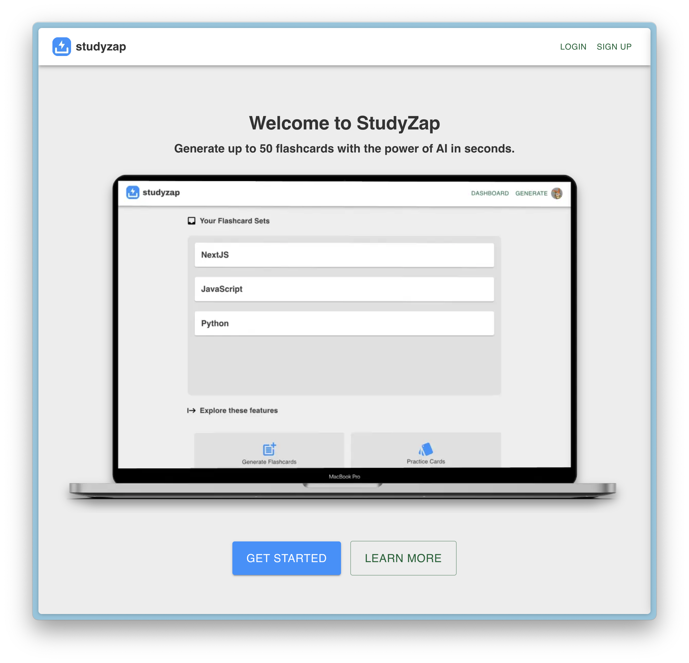
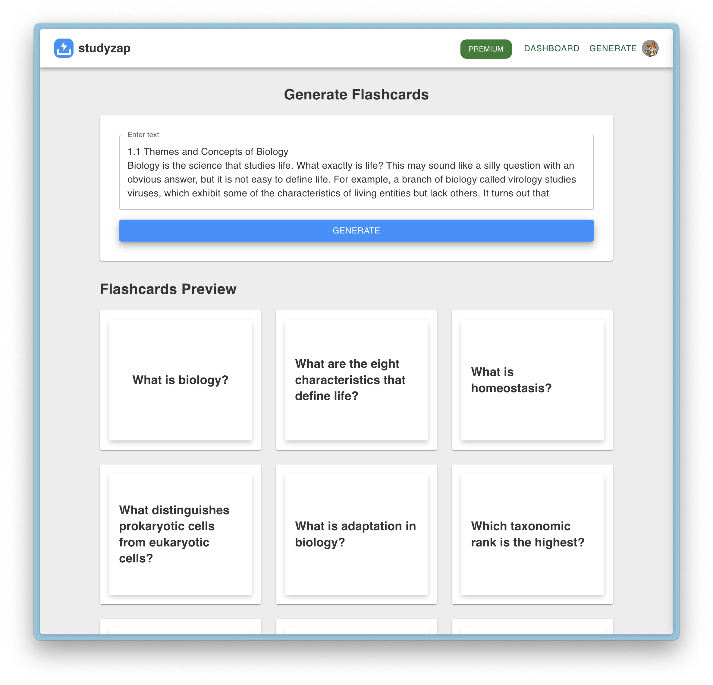

# studyzap.me

Practice with AI-generated flashcards from text input. Built with NextJS, JavaScript, OpenAI API, Clerk Auth, Firebase Firestore, and MaterialUI.

### Preview

### Generate Flashcards from text

###  Currently working on these features:
- Fully edit and add/delete individual cards
- Proper rate limiting and RBAC
- Utilize Stripe API for subscription-based roles / service.
